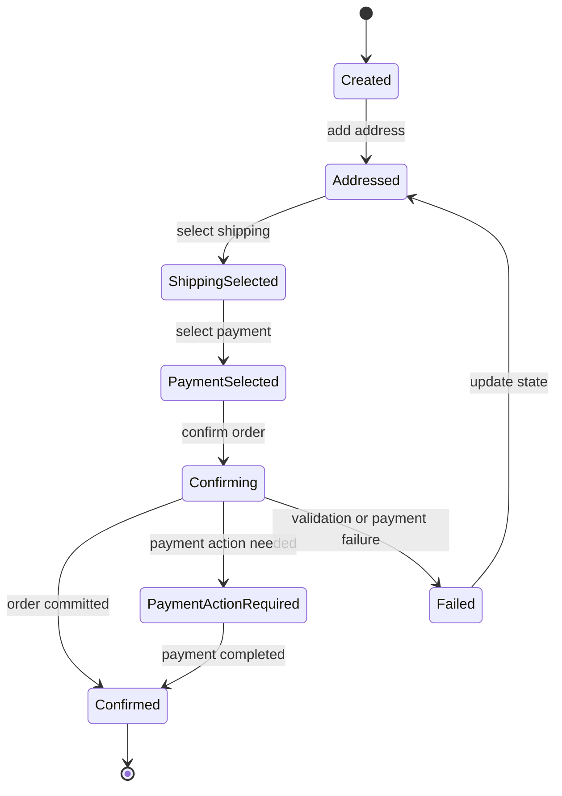

# Checkout State Contract

Checkout state is the central aggregate/read model for the customer-facing checkout flow. It lets guest shoppers resume checkout before an order exists.

## State Machine

Status slugs used by APIs:

- `created`
- `addressed`
- `shipping_selected`
- `payment_selected`
- `confirming`
- `payment_action_required`
- `confirmed`
- `failed`

## Required Concepts

- Tenant and shop context.
- Basket snapshot.
- Customer email and optional identity link.
- Billing and shipping addresses.
- Available and selected shipping options.
- Available and selected payment methods.
- Totals, discounts, vouchers, and tax estimates.
- Validation errors and next allowed actions.
- Idempotency key for state-changing operations.

## Consistency Rules

- Basket, address, shipping, payment, voucher, and confirmation mutations recalculate dependent state.
- Order confirmation must commit a MySQL order record before showing confirmation.
- Async side effects happen through the outbox after the order is committed.

