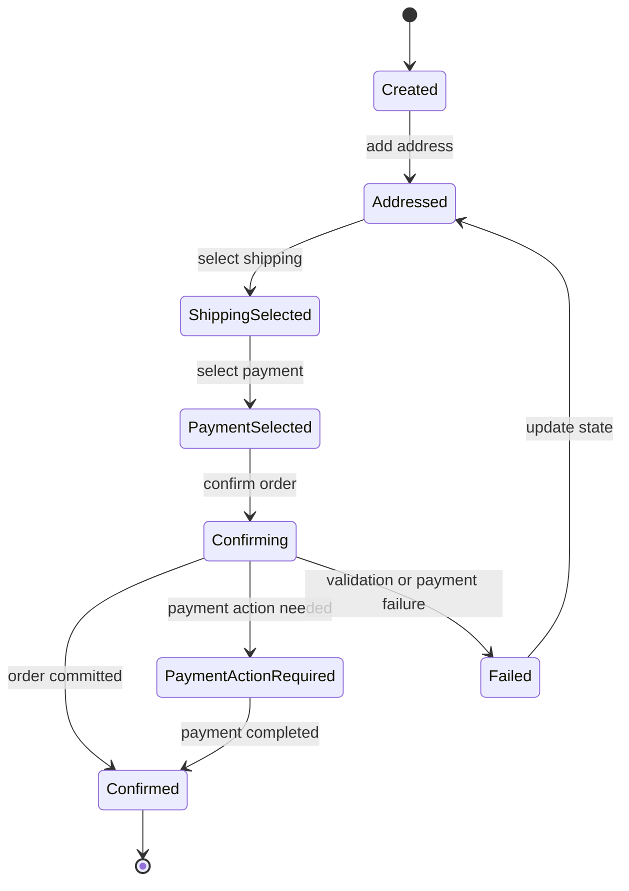

# Checkout State Contract

Checkout state is the central aggregate/read model for the customer-facing checkout flow. It lets guest shoppers resume checkout before an order exists.

## State Machine

Status slugs used by APIs:

- `created`
- `addressed`
- `shipping_selected`
- `payment_selected`
- `confirming`
- `payment_action_required`
- `confirmed`
- `failed`

## Required Concepts

- Tenant and shop context.
- Basket snapshot.
- Customer email and optional identity link.
- Billing and shipping addresses.
- Available and selected shipping options.
- Available and selected payment methods.
- Totals, discounts, vouchers, and tax estimates.
- Validation errors and next allowed actions.
- Idempotency key for state-changing operations.

## Consistency Rules

- Basket, address, shipping, payment, voucher, and confirmation mutations recalculate dependent state.
- Order confirmation must commit a MySQL order record before showing confirmation.
- Async side effects happen through the outbox after the order is committed.
- Local Phase 3 confirmation runs deterministic simulators before creating the order:
  - payment authorization runs first; invoice succeeds, while card fails when the tenant/shop/checkout/idempotency seed contains `simulate-payment-decline`;
  - inventory reservation runs second and decrements tenant-owned fixture stock only when every cart line has enough visible stock.
- Simulator business failures leave the checkout in `failed`, do not create an order, and do not emit `order.confirmed`.
- Failed checkout states must be repaired through a later checkout mutation before confirmation can be attempted again.
- Pre-commit inventory reservation and payment authorization simulation may block order creation. Post-commit async processors may change internal processor/projection state, but they must not decide whether the committed order exists.
- A duplicate confirmation request with the same tenant, checkout, and idempotency key must resolve to the same committed order result or the same deterministic failure.
- Payment simulator boundaries exclude real payment credentials, redirects to external providers, webhooks, captures against real processors, and PCI-scoped data.
- Inventory simulator boundaries exclude external warehouse calls and non-deterministic stock mutation. Reservation outcomes must be derived from tenant-scoped seeded stock, SKU, quantity, and idempotency key.

## Phase 3 Event Triggers

- Entering `Confirming` records `checkout.order.confirmation_requested`.
- Committing an order records `order.confirmed`.
- Extracted inventory processors consume `order.confirmed` or `inventory.reservation.requested` only after the order commit.
- Extracted payment processors consume capture request events only after the order commit or after an explicit deterministic simulator event.
- Notification, audit, and projection workers consume committed events after confirmation and must be replay-safe.
