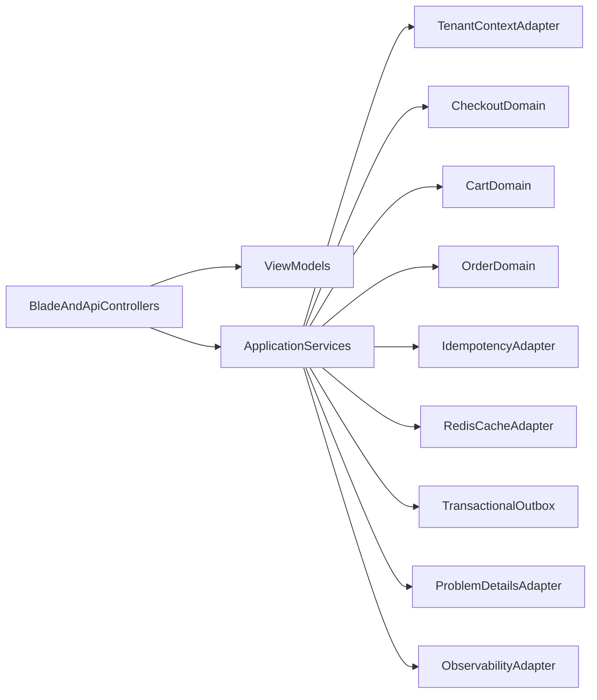

# C4: Checkout Components

```mermaid
flowchart LR
  Controller[BladeAndApiControllers] --> ViewModels[ViewModels]
  Controller --> AppServices[ApplicationServices]
  AppServices --> TenantContext[TenantContextAdapter]
  AppServices --> CheckoutDomain[CheckoutDomain]
  AppServices --> CartDomain[CartDomain]
  AppServices --> OrderDomain[OrderDomain]
  AppServices --> Idempotency[IdempotencyAdapter]
  AppServices --> Cache[RedisCacheAdapter]
  AppServices --> Outbox[TransactionalOutbox]
  AppServices --> Problems[ProblemDetailsAdapter]
  AppServices --> Observability[ObservabilityAdapter]
```

## Phase 1 Boundary

The first implementation keeps checkout orchestration inside Laravel. Go processors/services are added only after the Laravel happy path is working.
