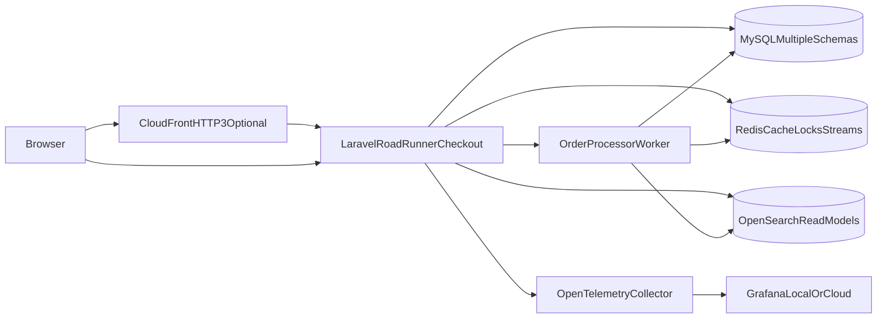

# C4: Containers

## Local Mode

- Laravel/RoadRunner
- MySQL
- Redis
- OpenSearch
- OpenTelemetry Collector
- Prometheus
- Loki
- Grafana
- Jaeger or Tempo

## Deploy Mode

- Amazon EKS
- CloudFront with HTTP/3 viewer connections
- AWS WAF
- ALB Ingress
- RDS MySQL
- ElastiCache Redis
- SQS/SNS
- Optional AWS OpenSearch
- Grafana Cloud by default
