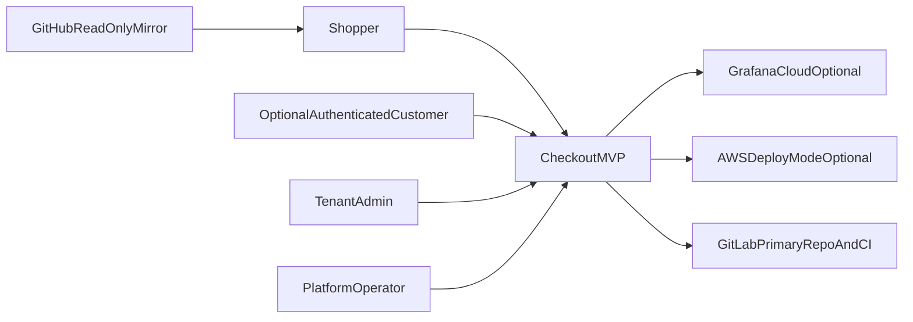

# C4: System Context

## Notes

- Shoppers can complete checkout without logging in.
- Login/signup is optional before, during, or after checkout.
- GitLab is the primary repository and CI/CD platform.
- GitHub exists for read-only discoverability.
