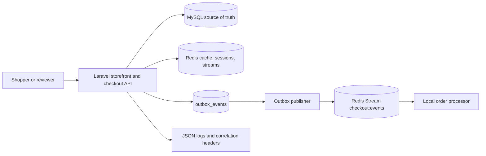
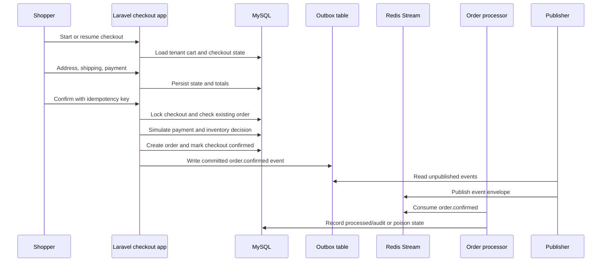

# Architecture Summary

## Purpose

This page gives a concise system view for human reviewers. It separates what
runs locally, what CI validates, what parity profiles smoke-test, and what the
optional AWS-oriented target would use later.

## Status

The current runnable system is a local Laravel checkout application with MySQL,
Redis, optional worker services, optional RoadRunner/Octane, and optional Caddy
edge parity. AWS-oriented deployment is documented as a target, not an active
production environment.

## Key points

- Laravel owns storefront routes, Blade views, public checkout APIs, validation,
  persistence, idempotency, checkout orchestration, and Problem Details
  rendering.
- Nginx/PHP-FPM over HTTP is the default local baseline on port 8080.
- RoadRunner/Octane is an optional runtime profile, not the default.
- Caddy is the local edge parity profile for HTTPS, H1, H2, H3, forwarded
  headers, security headers, and a 2 MB request body limit.
- MySQL is the checkout/order source of truth; local and CI use containers, while production planning targets RDS MySQL.
- Redis supports local cache/session/stream use. Redis Streams carry local async events from the outbox path.

## Details

### System context

### Checkout sequence

### Environment split

```mermaid
flowchart TB
  Local[Local default] --> LocalRuntime[Nginx + PHP-FPM over HTTP]
  Local --> LocalData[MySQL and Redis containers]
  Local --> LocalWorkers[Optional outbox and order processor workers]

  Runtime[Optional runtime profile] --> RoadRunner[RoadRunner/Octane HTTP smoke]
  Parity[Parity profile] --> Caddy[Caddy HTTPS H1/H2/H3 edge smoke]
  Parity --> Nginx[Nginx upstream]

  CI[GitLab CI] --> Tests[Checkout tests]
  CI --> RuntimeSmoke[RoadRunner smoke]
  CI --> ParitySmoke[Caddy edge smoke]
  CI --> WorkerSmoke[Selected worker smoke]

  AWS[AWS-oriented target] --> App[EKS application workloads]
  AWS --> RDS[(RDS MySQL)]
  AWS --> ManagedRedis[Managed Redis-style cache/stream target]
```

### Runtime profiles

| Mode | Runtime | Data | Purpose |
| --- | --- | --- | --- |
| Local default | Nginx to PHP-FPM over HTTP on port 8080 | MySQL and Redis containers | Fast development and review loop |
| Optional performance | RoadRunner/Octane | MySQL and Redis containers | Long-running Laravel runtime smoke testing |
| Parity edge | Caddy to Nginx/PHP-FPM | MySQL and Redis containers | HTTPS, H1/H2/H3, forwarded headers, security header smoke checks |
| CI | Containerized test jobs | MySQL and Redis services where needed | Repeatable validation |
| AWS-oriented target | EKS app workloads | RDS MySQL | Future manually approved deployment path |

### Protocol strategy

External edge traffic may support HTTPS over HTTP/1.1, HTTP/2, and HTTP/3 where
configured. HTTP/3/QUIC is edge smoke only in this repository. Laravel/PHP-FPM
does not terminate HTTP/3; Caddy handles that local edge profile and
reverse-proxies to Nginx.

Local async transport uses Redis Streams. Deploy messaging is planned as an AWS
SQS/SNS mapping after guardrails. If internal RPC is introduced, it defaults to
protobuf/gRPC over HTTP/2. The current checkout path is Laravel web/API plus
local Redis Streams, not a broad RPC service mesh.

## Current limitations

- AWS deployment is planned but not yet provisioned.
- The observability profile exists, but full application OTLP traces and metrics are not complete.
- Worker paths are local scaffold/demo support; later target architecture pivots
  toward Laravel publishing `order.placed`, a Go order preprocessor consuming it,
  and a Go inventory service materializing reservations before
  `order.confirmed`.
- HTTP/3 validation proves edge negotiation in the Caddy profile only.

## Source anchors

- [Project overview](../../README.md)
- [Checkout app overview](../../apps/checkout/README.md)
- [Local command entrypoints](../../Makefile)
- [CI pipeline](../../.gitlab-ci.yml)
- [Default Compose services](../../docker-compose.yml)
- [Caddy Compose overlay](../../docker-compose.caddy.yml)
- [Nginx local configuration](../../infra/local/nginx/checkout.conf)
- [Caddy edge configuration](../../infra/local/caddy/Caddyfile)
- [Caddy parity smoke check](../../scripts/test/checkout-parity.sh)
- [RoadRunner runtime smoke check](../../scripts/test/checkout-runtime.sh)
- [Web checkout routes](../../apps/checkout/routes/web.php)
- [Public checkout API routes](../../apps/checkout/routes/api.php)
- [Checkout orchestration implementation](../../apps/checkout/app/Application/Checkout/CheckoutManager.php)
- [Outbox publisher command](../../apps/checkout/app/Console/Commands/PublishOutboxEvents.php)
- [Order processor command](../../apps/checkout/app/Console/Commands/ConsumeOrderConfirmedEvents.php)
- [Laravel boundary decision](adr/0006-laravel-clean-boundaries.md)
- [RDS MySQL decision](adr/0007-production-database-rds-mysql.md)

## Where to go from here

Read the [tradeoff summary](tradeoff-summary.md) to understand why these
boundaries were chosen, then read [known gaps](known-gaps.md) before reviewing
the older [C4 supporting views](architecture/README.md).
