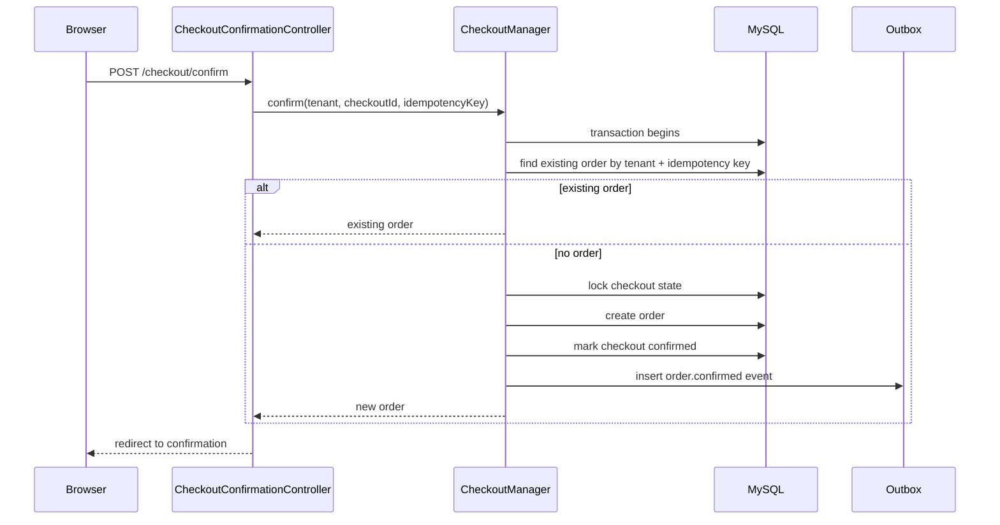
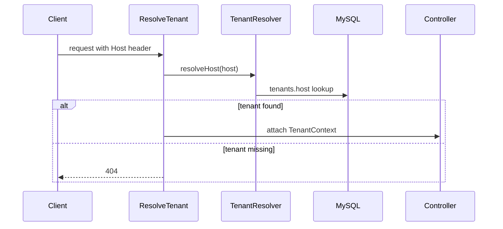
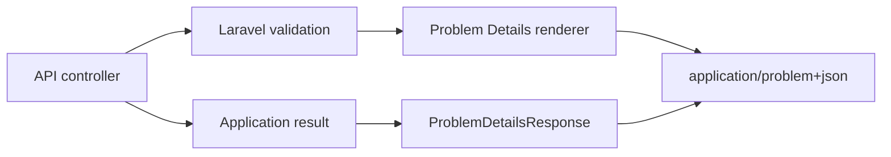

# C4: Code Diagrams

Phase 1 status: code-level diagrams are intentionally limited to high-value flows. Add or expand diagrams only when tests and component docs no longer make the behavior clear enough.

## Order Confirmation

## Tenant Resolution

## API Problem Details

