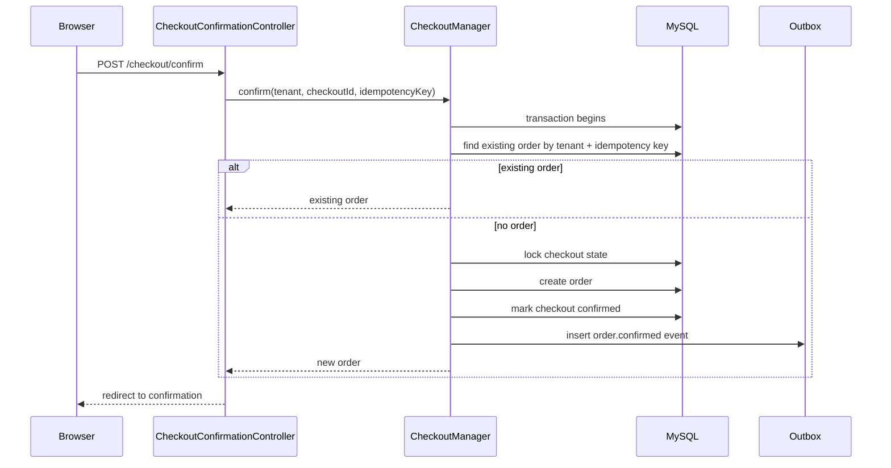
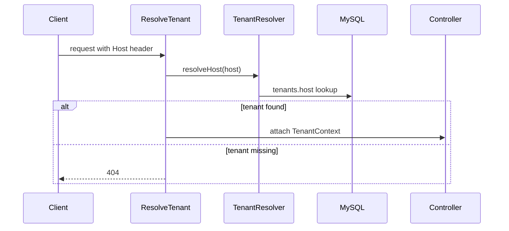
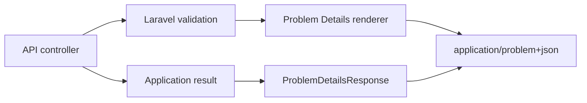
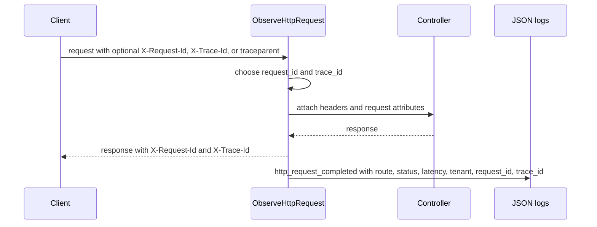
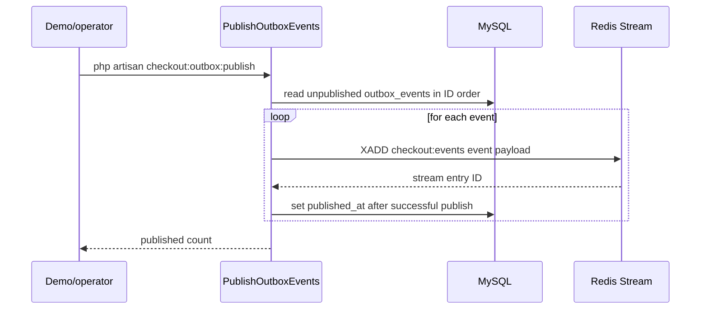
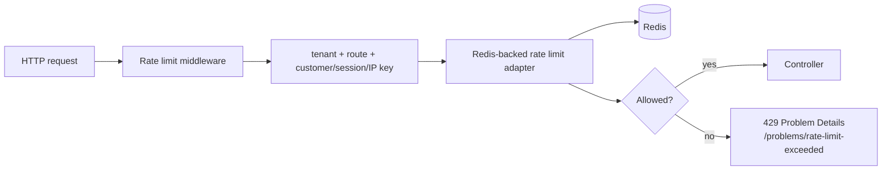

# C4 Level 4: Code Diagrams

Code-level diagrams are intentionally limited to high-value flows. Add or expand diagrams only when tests and component docs no longer make the behavior clear enough.

## Order Confirmation

Key code:

- `app/Http/Controllers/Web/CheckoutConfirmationController.php`
- `app/Http/Controllers/Api/CheckoutOrderConfirmationController.php`
- `app/Application/Checkout/CheckoutManager.php`
- `app/Infrastructure/Persistence/Eloquent/OrderRecord.php`
- `app/Infrastructure/Persistence/Eloquent/OutboxEventRecord.php`

## Tenant Resolution

Key code:

- `app/Http/Middleware/ResolveTenant.php`
- `app/Application/Tenant/TenantResolver.php`
- `app/Domain/Tenant/TenantContext.php`
- `app/Infrastructure/Persistence/Eloquent/TenantRecord.php`

## API Problem Details

Key code:

- `bootstrap/app.php`
- `app/Http/Responses/ProblemDetailsResponse.php`
- `app/Http/Responses/WebProblemDetailsResponse.php`

## HTTP Correlation

Key code:

- `app/Http/Middleware/ObserveHttpRequest.php`
- `bootstrap/app.php`
- `config/logging.php`

## Outbox Publication

Key code:

- `app/Console/Commands/PublishOutboxEvents.php`
- `app/Infrastructure/Persistence/Eloquent/OutboxEventRecord.php`
- `Makefile` targets `demo-outbox-publish` and `demo-redis-events`

## Planned Rate Limiting

Rate limiting is intentionally shown as planned code, not current runtime behavior. It belongs in `app/Http/Middleware` with a Redis-backed infrastructure adapter under `app/Infrastructure`, and it should return RFC 9457 Problem Details rather than controller-specific responses.
