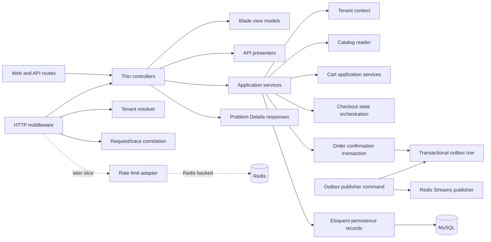

# C4 Level 3: Checkout Components

## Current Boundary

- `app/Http`: route entry points, validation, Blade responses, API presenters, Problem Details responses, and tenant middleware.
- `app/Application`: checkout/cart/catalog/tenant use cases and transaction boundaries.
- `app/Domain`: enums and domain concepts such as checkout status, shipping options, payment methods, stock state, order status, and tenant context.
- `app/Infrastructure`: Eloquent persistence records for tenant, product, variant, cart, checkout state, order, and outbox tables.
- `app/Console`: operational commands such as `checkout:outbox:publish`.
- `resources/views`: Blade templates that render explicit view models and do not query persistence.

Order confirmation is the core transaction boundary. It creates one order for a tenant/idempotency key, transitions checkout state to confirmed, and writes an `order.confirmed` outbox row.

## Runtime Components

- Web controllers render storefront, cart, checkout, and order confirmation views.
- API controllers expose checkout config, checkout state, address, basket item, shipping option, payment method, and order confirmation endpoints.
- `CheckoutManager` owns the transactional state changes for checkout creation, mutation, totals, and confirmation.
- `ProblemDetailsResponse` and framework exception rendering keep public API errors aligned to RFC 9457.
- `ObserveHttpRequest` adds request and trace IDs to request attributes, response headers, and structured completion logs.
- `PublishOutboxEvents` publishes unpublished `outbox_events` rows to the Redis Stream `checkout:events` and marks rows published only after Redis accepts the event.

## Deferred Boundaries

- External broker delivery such as SQS/SNS is later work.
- OpenSearch indexing is a later read-model projection.
- Redis-backed route/tenant/customer/IP rate limiting belongs behind an HTTP middleware plus infrastructure adapter, not inside controllers.
- Go processors/services remain optional after the Laravel happy path and require a documented concurrency, async, or latency reason plus a stable contract.
- Full OTLP traces/metrics and provider-specific observability backend selection are deferred behind the OTLP boundary.
