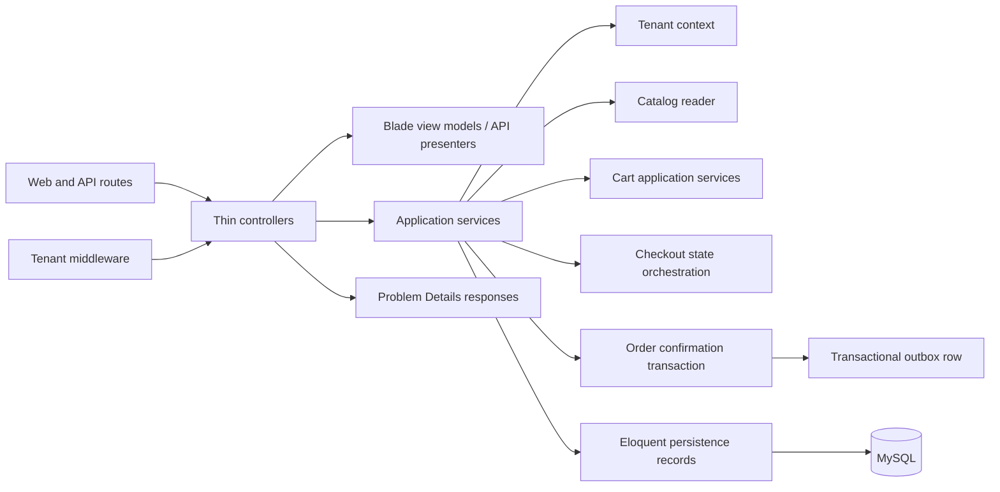

# C4: Checkout Components

## Phase 1 Boundary

- `app/Http`: route entry points, validation, Blade responses, API presenters, Problem Details responses, and tenant middleware.
- `app/Application`: checkout/cart/catalog/tenant use cases and transaction boundaries.
- `app/Domain`: enums and domain concepts such as checkout status, shipping options, payment methods, stock state, order status, and tenant context.
- `app/Infrastructure`: Eloquent persistence records for tenant, product, variant, cart, checkout state, order, and outbox tables.
- `resources/views`: Blade templates that render explicit view models and do not query persistence.

Order confirmation is the core Phase 1 transaction boundary. It creates one order for a tenant/idempotency key, transitions checkout state to confirmed, and writes an `order.confirmed` outbox row.

## Deferred Boundaries

- Outbox publication to Redis Streams/SQS is later work.
- OpenSearch indexing is a later read-model projection.
- Go processors/services remain optional after the Laravel happy path and require a documented concurrency, async, or latency reason plus a stable contract.
- Observability backend selection is deferred behind the OTLP boundary.
