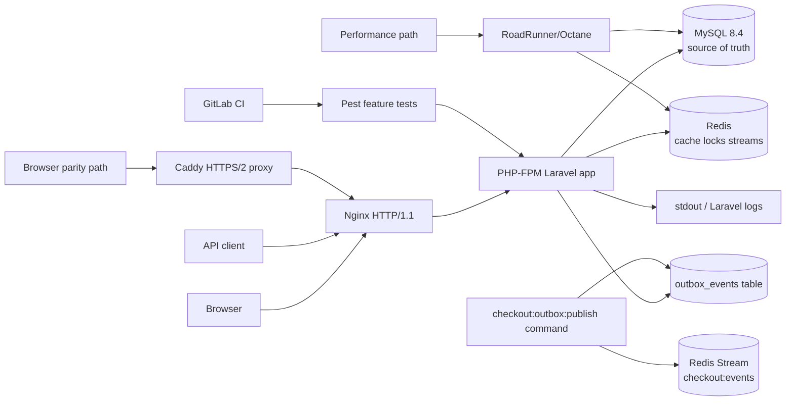
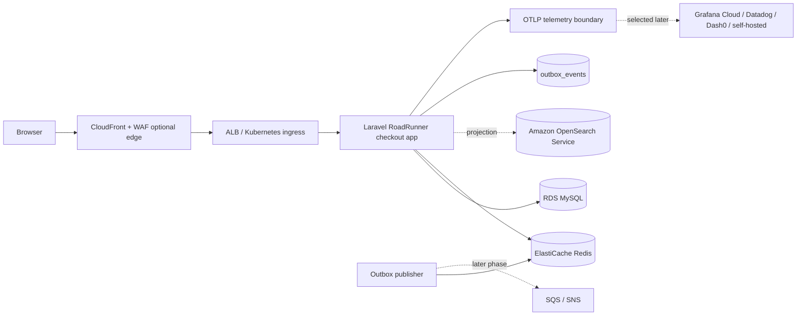

# C4 Level 2: Containers

## Local/Dev Mode - Current Phase 2

Current local default is intentionally small:

- `mysql`: MySQL source-of-truth database.
- `redis`: Redis support service for cache, locks, idempotency/rate-limit backing, and Redis Streams.
- `checkout`: Laravel app running as PHP-FPM for the default local path, enabled with `COMPOSE_PROFILES=app`.
- `nginx`: default local web entrypoint on HTTP/1.1, published as `http://localhost:8080`.
- Startup runs pending migrations and idempotent seeders before serving the app.
- `checkout-roadrunner`: optional RoadRunner/Octane performance profile, started with `make up-roadrunner`.
- `make up-parity` layers Caddy in front of the default web stack for local-production parity: HTTPS, HTTP/2, forwarded headers, security headers, and request-size limits.
- Keep HTTPS and the reverse proxy out of the default TDD loop. Future gRPC endpoints are the exception and must use HTTP/2 even on the fast path.
- The outbox publisher is a Laravel command, `checkout:outbox:publish`, exposed for demos through `make demo-outbox-publish`.

Optional local profiles:

- `search`: OpenSearch read-model service. It is not wired into checkout/order writes in the current local demo.
- `observability`: OpenTelemetry Collector, Prometheus, Loki, Tempo, Jaeger, and Grafana services kept as an optional fallback. The current app demonstrates request/trace correlation and JSON logs; full app OTLP export remains a later slice.
- `identity`: Keycloak placeholder for later optional auth work.

## Deploy Mode - Planned/Optional

Deploy mode remains optional and manually approved. RoadRunner is the preferred production-style PHP runtime, but Kubernetes, OpenSearch projections, external message brokers, workers, and cloud telemetry exporters stay behind explicit later slices.

Amazon EKS is the production target for application workloads. Production MySQL runs on Amazon RDS for MySQL, not as a self-managed StatefulSet or other in-cluster database on EKS. Local Docker Compose MySQL, and any future `kind` MySQL binding, exist only for development, testing, and local manifest validation.

## Non-Negotiable Boundaries

- MySQL decides whether checkout state and orders exist.
- Production MySQL is Amazon RDS for MySQL; this keeps managed backups, patching, Multi-AZ/failover options, and stateful database operations outside EKS.
- OpenSearch is a rebuildable projection/read model only.
- The transactional outbox table is the durability boundary; Redis Streams publication is local/demo async delivery and remains retryable.
- Go workers/services require a documented concurrency, async, or latency reason plus a stable contract.
- Observability backend selection stays behind the OTLP boundary.
