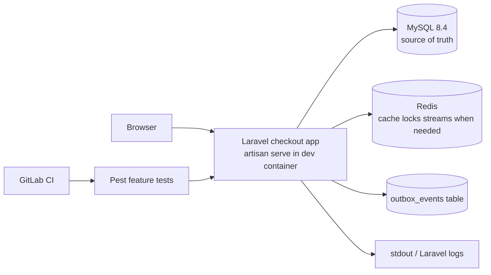
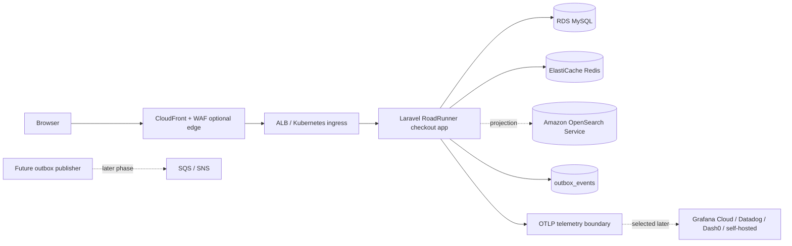

# C4: Containers

## Local/Dev Mode - Current Phase 1

Current local default is intentionally small:

- `mysql`: MySQL source-of-truth database.
- `redis`: Redis support service for cache/locks/streams as features need them.
- `checkout`: Laravel app, enabled with `COMPOSE_PROFILES=app`.
- Startup runs pending migrations and idempotent seeders before serving the app.

Optional local profiles:

- `search`: OpenSearch read-model service. It is not wired into checkout/order writes in Phase 1.
- `observability`: local observability services kept as an optional fallback. The application contract is OpenTelemetry/OTLP, but no backend is required for Phase 1 checkout development.
- `identity`: Keycloak placeholder for later optional auth work.

## Deploy Mode - Planned/Optional

Deploy mode remains optional and manually approved. RoadRunner, Kubernetes, OpenSearch projections, workers, and cloud telemetry exporters are planned deployment capabilities, not required for the current Phase 1 local checkout path.

Amazon EKS is the production target for application workloads. Production MySQL runs on Amazon RDS for MySQL, not as a self-managed StatefulSet or other in-cluster database on EKS. Local Docker Compose MySQL, and any future `kind` MySQL binding, exist only for development, testing, and local manifest validation.

## Non-Negotiable Boundaries

- MySQL decides whether checkout state and orders exist.
- Production MySQL is Amazon RDS for MySQL; this keeps managed backups, patching, Multi-AZ/failover options, and stateful database operations outside EKS.
- OpenSearch is a rebuildable projection/read model only.
- The transactional outbox table exists; publishing to Redis Streams or SQS/SNS is later work.
- Go workers/services require a documented concurrency, async, or latency reason plus a stable contract.
- Observability backend selection stays behind the OTLP boundary.
