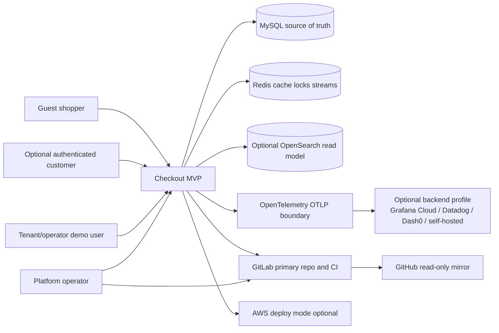

# C4 Level 1: System Context

## Context

- Shoppers can browse tenant storefronts, add product variants to cart, and complete guest checkout without login.
- Optional customer login/signup stays outside the current required checkout path.
- Tenant identity is resolved by verified host in local mode, for example `fashion-demo.localhost` or `sports-demo.localhost`.
- MySQL is the durable source of truth for tenants, catalog, cart, checkout state, orders, and outbox rows.
- Production deploy mode uses Amazon RDS for MySQL. Local Docker Compose MySQL, and any future `kind` MySQL binding, are local/dev/test only; EKS runs application workloads and does not host the production database.
- Redis is used locally for support concerns such as cache, locks, idempotency/rate-limit backing, and Redis Streams. Checkout existence does not depend on async side effects.
- OpenSearch is optional and remains a read model/projection, not a transactional checkout dependency.
- Observability is OpenTelemetry/OTLP-first. The current demo has request/trace correlation headers and structured JSON HTTP logs; full OTLP traces/metrics and provider-specific exporters remain later profile work.
- GitLab is primary. GitHub remains a mirror/portfolio target.

## System Responsibilities

- Provide a tenant-aware checkout demo that is original and SCAYLE-inspired without copying proprietary behavior or schemas.
- Demonstrate transactional checkout consistency with ACID order confirmation, idempotency keys, and a durable outbox event.
- Keep local development free or near-free with Docker Compose as the fastest demo runtime.
- Keep AWS/EKS deployment optional and manually approved until cost, ownership, rollback, and destroy guardrails are explicit.

## Trust Boundaries

- Public browser and API traffic crosses into the checkout system through host-resolved tenant routing.
- MySQL and Redis are internal data stores in local mode and managed services in a future deploy mode.
- GitLab CI is trusted for validation, but secrets and deploy credentials must stay outside committed docs and source files.
- Observability backends are optional consumers of telemetry, not decision makers for checkout state or order existence.
