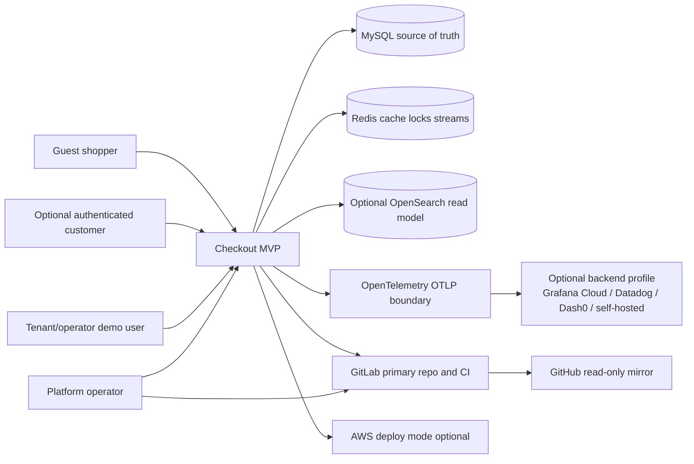

# C4: System Context

## Context

- Shoppers can browse products, add a variant to cart, and complete checkout without login.
- Optional customer login/signup stays outside the Phase 1 required checkout path.
- Tenant identity is resolved by verified host in local mode, for example `fashion-demo.localhost` or `sports-demo.localhost`.
- MySQL is the durable source of truth for tenants, catalog, cart, checkout state, orders, and outbox rows.
- Production deploy mode uses Amazon RDS for MySQL. Local Docker Compose MySQL, and any future `kind` MySQL binding, are local/dev/test only; EKS runs application workloads and does not host the production database.
- Redis is available for local cache/locks/streams but checkout existence does not depend on async side effects.
- OpenSearch is optional and remains a read model/projection, not a transactional checkout dependency.
- Observability is OpenTelemetry/OTLP-first. Grafana Cloud, Datadog, Dash0, or self-hosted Grafana are later exporter profiles.
- GitLab is primary. GitHub remains a mirror/portfolio target.
