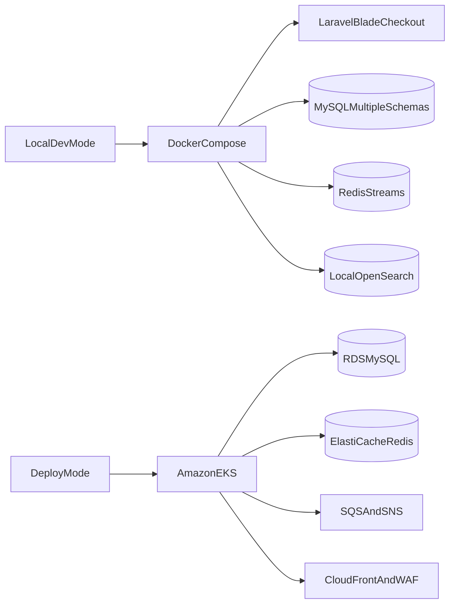
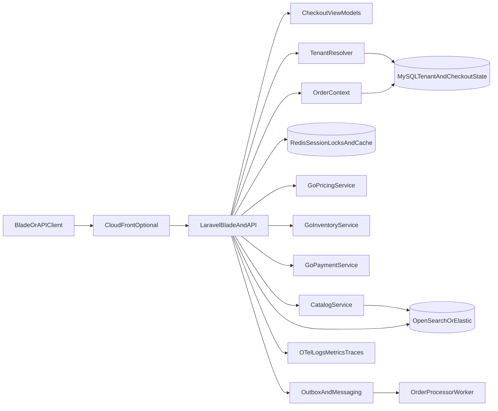

# Multi-Tenant Checkout MVP Demo Plan

## Target Shape

Create a single monorepo with clear service boundaries, free local execution, and optional AWS EKS deployment assets. The demo should prove multi-tenant SaaS checkout architecture with a simple working UI first: tenant isolation, catalog and cart seed data, SCAYLE-inspired checkout flow, DDD boundaries, checkout state transitions, latency SLOs, observability, messaging, and infrastructure automation.

Proposed structure:

- `[apps/checkout](apps/checkout)` - Laravel PHP app served by RoadRunner, containing the Blade checkout UI, public checkout API, application services, Eloquent models, and checkout domain orchestration.
- `[services/inventory-service](services/inventory-service)` - optional Go gRPC service for stock reservation/release once the Laravel happy path is stable.
- `[workers/order-processor](workers/order-processor)` - selected Go worker for async order side effects, payment settlement simulation, search indexing, analytics, and notification events.
- `[workers/outbox-publisher](workers/outbox-publisher)` - Go or Laravel worker that publishes committed outbox events to Redis Streams locally or SQS/SNS in deploy mode.
- `[proto](proto)` - shared gRPC contracts.
- `[seed](seed)` - deterministic tenant, catalog, product image, variation, cart, and checkout seed data.
- `[infra/terraform](infra/terraform)` - optional HashiCorp Terraform for VPC, EKS, CloudFront, RDS MySQL, ElastiCache Redis, OpenSearch/Elastic option, IAM, budgets, and Datadog integration.
- `[infra/k8s](infra/k8s)` - Kubernetes manifests or Helm-style overlays for local Kubernetes and optional EKS deployment.
- `[docker](docker)` - Dockerfiles and local development images.
- `[.gitlab-ci.yml](.gitlab-ci.yml)` - primary GitLab CI/CD pipeline for lint, test, build, scan, images, preview/demo checks, and optional deploy.
- `[.github/workflows](.github/workflows)` - optional mirror validation only.
- `[docs](docs)` - architecture decision records, runbooks, diagrams, and agent handoff docs.

## Documentation Model

Use the C4 model as the primary architecture documentation structure.

C4 deliverables:

- System Context: shoppers, optional authenticated customers, tenant admins, platform operators, payment simulation, carrier/collection point simulation, observability backend, and AWS/Grafana Cloud dependencies.
- Container Diagram: Laravel/RoadRunner checkout app, MySQL schemas, Redis, OpenSearch, workers, optional Go services, OTel Collector, messaging, CloudFront/WAF, and EKS deployment components.
- Component Diagrams: checkout orchestration components, tenant resolution, cart/checkout/order contexts, outbox publisher, observability adapters, Problem Details adapter, cache/rate-limit/idempotency adapters.
- Code Diagrams: only for high-value areas such as checkout state machine, order confirmation transaction, inventory reservation, and outbox publishing.

Keep C4 diagrams in `[docs/architecture](docs/architecture)` and use them alongside ADRs. Prefer diagrams that clarify service boundaries and data flow rather than documenting every class.

## Execution Modes

Split the project into two explicit modes so the MVP can be built for free while still demonstrating cloud readiness.

Local/dev mode:

- Runs with Docker Compose first: Laravel/RoadRunner, MySQL, Redis, local OpenSearch, optional Keycloak later, and local workers.
- Starts with a simple Laravel + Blade UI using MVVM-style view models.
- Seeds two tenants with random but deterministic catalog, product variation, cart, and checkout data.
- Does not require login for shopping or checkout.
- Allows optional login/signup at any stage, and especially after checkout as an account-creation prompt.
- Uses Redis Streams for local async events.
- Uses OpenTelemetry-compatible telemetry with local Prometheus, Loki, Grafana, Jaeger or Tempo, structured logs, and Grafana Cloud configuration placeholders.
- Uses RFC 9457 Problem Details for HTTP/API errors.
- UI views do not query the database directly. Controllers call application services, application services use repositories/read models, and Blade receives explicit view models.

Deploy mode:

- Targets Amazon EKS through Terraform and Kubernetes manifests.
- Uses RDS MySQL, ElastiCache Redis, optional AWS OpenSearch, CloudFront with HTTP/3 for viewer connections, AWS WAF, ALB Ingress, OpenTelemetry Collector, Grafana Cloud by default, optional Datadog, and AWS SQS/SNS for async messaging.
- Keeps cloud deployment manual/optional until an AWS account and budget guardrails exist.
- Includes cost controls, TTL tags, budget alarms, and destroy runbooks before any `terraform apply`.




## Domain-Driven Design Boundaries

Use DDD to keep the codebase understandable even when everything starts inside one Laravel app.

Initial bounded contexts:

- Tenant Context: tenant, shop, domain, brand settings, currency, language, feature flags.
- Catalog Context: products, variants, images, categories, badges, searchable product data.
- Cart Context: cart items, selected variants, quantity, trust-building cart display.
- Checkout Context: checkout state, addresses, shipping selection, payment selection, validation, totals.
- Order Context: order creation, order lines, idempotency, order state transitions.
- Inventory Context: stock availability, reservation, release, oversell prevention.
- Pricing Context: prices, discounts, vouchers, tax estimates, totals.
- Identity Context: optional login/signup and post-checkout account creation.

MySQL layout:

- Use one MySQL instance in local mode.
- Use multiple logical schemas, for example `tenant`, `catalog`, `checkout`, `orders`, `identity`, and `observability_demo`.
- Keep schema ownership aligned with bounded contexts.
- Design repository interfaces so a schema can later move to a separate database or instance without rewriting controllers/views.
- Avoid cross-schema writes from the UI layer. Application services coordinate transactions inside the checkout/order boundary.

## Checkout Flow

Backend API-first, multi-tenant flow:




SCAYLE-inspired public API shape:

- `GET /api/co/v3/state/config` - checkout configuration, supported countries, payment configuration hints, feature flags, tenant branding, and cacheable public settings.
- `PUT /api/co/v3/state` - create or resume the checkout state from a signed checkout token containing basket/cart context.
- `GET /api/co/v3/state` - return the current checkout state, including basket, addresses, available shipping options, available payment methods, totals, validation errors, and next allowed actions.
- `PATCH /api/co/v3/state` - update partial checkout-level state such as customer email, consent flags, custom data, or newsletter opt-in.
- `PUT /api/co/v3/state/addresses/{type}` - create or update `billing` or `shipping` address.
- `DELETE /api/co/v3/state/addresses/{type}` - delete an address.
- `POST /api/co/v3/state/addresses/copy` - copy billing address to shipping or shipping to billing.
- `PUT /api/co/v3/state/shipping-options/{id}` - select an available shipping option.
- `PUT /api/co/v3/state/payment-methods/{id}` - select a payment method.
- `PATCH /api/co/v3/state/payment-methods/{id}` - update payment method details or payment-specific metadata.
- `POST /api/co/v3/state/order-confirmation` - confirm order by starting the payment flow and returning updated state or redirect/action details.
- `PUT /api/co/v3/state/basket/items/{id}` - update basket item quantity; quantity `0` removes the item.
- `POST /api/co/v3/state/vouchers` - add voucher code to the order.
- `DELETE /api/co/v3/state/vouchers/{code}` - remove voucher code from the order.
- `GET /api/co/v3/state/collection-points` - search carrier collection points by postal code/address.
- `PUT /api/co/v3/state/loyalty` - attach or register loyalty information.
- `DELETE /api/co/v3/state/loyalty` - detach loyalty information.
- `GET /api/co/v3/address-book` - retrieve authenticated customer addresses.
- `GET /api/storefront/pre-purchase/products` - demo-only catalog endpoint for seeded product cards with images, prices, badges, and variation options.
- `POST /api/storefront/cart/items` - demo-only cart endpoint for adding selected product variations before checkout state is initialized.

Initial Blade routes for Phase 1:

- `GET /` - redirect to the default demo tenant shop.
- `GET /shop` - tenant-aware product listing using seeded products and images.
- `GET /product/{slug}` - product detail with variation selection.
- `POST /cart/items` - add selected variation to cart.
- `GET /cart` - concise trust-building cart screen.
- `GET /checkout` - current checkout state screen.
- `POST /checkout/address` - submit shipping/billing address.
- `POST /checkout/shipping-option` - select shipping option.
- `POST /checkout/payment-method` - select simulated payment method.
- `POST /checkout/confirm` - place order and start async post-order processing.
- `GET /checkout/confirmation/{orderRef}` - confirmation screen with optional account creation prompt.
- `GET /auth/login` and `GET /auth/signup` - optional only, not required to complete checkout.

Do not copy SCAYLE's full OpenAPI document verbatim into this repo. Use the public documentation as a reference for resource concepts and flow, then create an original MVP OpenAPI spec in `[docs/api/openapi.checkout.yaml](docs/api/openapi.checkout.yaml)` with compatible ideas, simplified schemas, and clear attribution in the docs.

Where copying SCAYLE too closely does not serve a new demo app today:

- Endpoint paths and versioning: keep the idea of a checkout `state`, but do not blindly copy `/api/co/v3/...` as the only public shape if the demo app benefits from clearer local Blade routes and simpler API names.
- Complete resource breadth: skip loyalty, collection points, address book, carrier integrations, real payment providers, and full account APIs until the core checkout path is working.
- Exact schemas: create original simplified request/response models focused on the demo, not SCAYLE-compatible payloads.
- Token flow: use a signed checkout token concept, but do not copy SCAYLE-specific JWT claims, issuer/audience assumptions, or shop-secret behavior beyond the general pattern.
- UI behavior: build an original Blade checkout experience using seeded tenants/products; do not replicate SCAYLE checkout component UI or proprietary interaction details.
- Tenant model: design tenant resolution for this SaaS demo using verified domains and internal tenant IDs, not SCAYLE tenant-space naming or URL conventions.
- Error catalog: use RFC 9457 Problem Details with original problem type URIs and domain errors.
- Admin/import APIs: do not recreate SCAYLE Admin API. Seed data and simple internal commands are enough for Phase 1.
- Commercial capabilities: avoid cloning SCAYLE-specific enterprise features. Use original examples that demonstrate architecture: tenant isolation, checkout consistency, observability, and async processing.

Keep from SCAYLE as inspiration:

- Headless/API-first checkout mindset.
- Checkout state as the central aggregate/read model.
- Basket included in the current checkout state.
- Dependent state recalculation after address, shipping, payment, voucher, and basket changes.
- Strong separation between customer-facing storefront APIs and backend/admin capabilities.
- Multi-tenant commerce platform framing.

Why checkout state instead of only direct order endpoints:

- Checkout is a multi-step workflow where addresses, shipping, payment methods, stock, vouchers, and totals depend on each other.
- Guest shoppers need resumable state before they become authenticated customers.
- A signed checkout token or state handle allows idempotency, retry, fraud checks, stock refresh, and payment redirects without creating an order too early.
- SCAYLE's public headless checkout flow also centers around initializing/resuming checkout state and repeatedly fetching current state.

Avoid `tenants/{tenant}` in public checkout URLs. Tenant identity should be resolved from a verified shop domain, signed token claims, or authenticated API client configuration. A path tenant can be useful for local demos, but it must never be trusted as the authorization boundary.

Recommended tenant resolution:

- Production-style: `fashion-demo.localhost`, `sports-demo.localhost`, or real shop domains mapped to tenant records.
- API/demo: signed checkout token includes `tenant_id`, `shop_id`, `basket_id`, `aud`, `iss`, `iat`, `nbf`, and `exp`.
- Internal/admin APIs only: `/internal/tenants/{tenantId}/...`, protected by service authentication and not exposed through the storefront gateway.

## Latency SLOs And API SLAs

Use "SLO" for engineering targets and reserve "SLA" for external contractual guarantees. The MVP should document both, but implement SLOs first.

Primary latency goal:

- Public API demo target: p95 under `1000ms` and p99 under `1000ms` for warm-path requests under the stated load profile.
- Hard gateway timeout: `1000ms` for cacheable/read-heavy endpoints and `1500ms` maximum for state-changing checkout endpoints during local development.
- Order confirmation returns in under `1000ms` by starting the payment flow and returning updated state/action details. Long-running payment settlement, email, search indexing, and analytics continue asynchronously.

Endpoint-specific SLOs:

- `GET /api/co/v3/state/config`: p95 under `100ms`, cacheable at CloudFront for `60-300s` by tenant and environment.
- `GET /api/storefront/pre-purchase/products`: p95 under `250ms`, cacheable at CloudFront for `60s`, with product images served from CDN/static storage.
- `POST /api/storefront/cart/items`: p95 under `400ms`, no CDN caching, Redis-backed cart/session write-through to MySQL as needed.
- `PUT /api/co/v3/state`: p95 under `500ms`, verifies signed checkout token and initializes/resumes state.
- `GET /api/co/v3/state`: p95 under `500ms`, Redis read-through cache with MySQL fallback and parallel gRPC calls only when state is stale.
- Address/shipping/payment selection endpoints: p95 under `700ms`, because they can invalidate dependent state.
- Basket quantity/voucher updates: p95 under `700ms`, with stock and pricing recalculation bounded by gRPC deadlines.
- `POST /api/co/v3/state/order-confirmation`: p95 under `900ms`, starts payment/order flow, uses idempotency key, and returns a deterministic state response.

Other SLOs:

- Availability: `99.5%` for MVP demo services locally or in a single demo environment; document `99.9%+` as a future production target requiring multi-AZ infrastructure.
- Error rate: under `1%` 5xx for normal demo traffic, under `0.1%` for cached/config/catalog reads.
- Checkout consistency: no duplicate order for the same idempotency key.
- Inventory consistency: no oversell within a tenant/SKU/variation in the simulated reservation model.
- Tenant isolation: zero cross-tenant reads/writes in integration tests and authorization tests.
- Freshness: checkout state recalculates stock/pricing after cart mutation and before order confirmation.
- Observability: every request has request ID, tenant tag, trace ID, route name, latency, status code, and downstream gRPC timing.
- Security: no tenant selected only by untrusted path parameter; all state mutation endpoints require signed checkout token or authenticated customer/session context.
- Error contract: public HTTP APIs return RFC 9457 `application/problem+json` for errors, with stable problem `type`, `title`, `status`, `detail`, `instance`, `traceId`, `tenantId` when safe, and field-level `errors` for validation.

CloudFront use:

- Use CloudFront for static product images, tenant branding assets, checkout config, and pre-purchase product/card reads.
- Enable HTTP/3 at the CloudFront viewer edge when deployed to AWS.
- Do not cache personalized checkout state, address, payment, voucher, or order confirmation responses at CloudFront.
- Include cache keys by host/tenant, language, currency, and country where relevant.

## Protocol Strategy

Use HTTP/3 where it gives the best risk/reward: client-to-edge traffic over the public internet. Keep service internals on mature protocols unless benchmarks prove an end-to-end HTTP/3 setup is worth the added operational complexity.

- Client to edge: support HTTP/3 through CloudFront in deploy mode. This can improve mobile/browser experience by reducing connection setup overhead, supporting QUIC connection migration, and avoiding TCP head-of-line blocking on unreliable networks.
- Edge to Laravel origin: use the simplest supported stable origin protocol, usually HTTP/1.1 or HTTP/2 depending on ingress/origin support.
- Laravel/RoadRunner HTTP server: use RoadRunner for long-running PHP workers and HTTP handling; do not depend on RoadRunner itself for HTTP/3 unless the chosen version and deployment stack explicitly support it.
- Internal service calls: use mature gRPC over HTTP/2 only where a service boundary has been intentionally extracted, for example inventory or order processing.
- Async communication: use domain events over Redis Streams locally and SQS/SNS in deploy mode. Prefer events over synchronous calls for post-order side effects.
- Local development: HTTP/1.1 is enough for Blade UI and API testing; HTTP/3 belongs in deploy-mode edge validation, not Phase 1 local complexity.
- Benchmark track: add an optional later experiment for end-to-end HTTP/3 if RoadRunner, ingress, service mesh, clients, load-testing tools, and observability support are all stable enough.

HTTP/3 is forward-looking and should be enabled at the edge. Low latency still primarily comes from fewer round trips, cacheable reads, hot RoadRunner workers, efficient MySQL/Redis access, bounded gRPC deadlines, async post-order work, and avoiding unnecessary synchronous service calls.

## Service Design

Use Laravel for the public checkout orchestration layer because it gives fast MVP velocity, strong API ergonomics, and familiar PHP patterns. Run it with RoadRunner to demonstrate production-oriented PHP performance and lower request overhead than classic PHP-FPM.

Use Laravel + Blade for the initial UI and checkout application layer. Blade templates receive view models and should not contain database queries or domain decisions.

Core implementation principle:

- PHP/Laravel owns checkout orchestration, Blade UI, public REST/API endpoints, tenant-aware application services, validation, Eloquent persistence, and the first complete happy path.
- Go is used selectively for internal services/processors where it clearly helps: inventory reservation, outbox publishing, order processing, payment settlement simulation, search indexing, analytics event consumers, or high-throughput workers.
- Do not split pricing, catalog, payment, order, and inventory into separate Go services by default. Extract only after the Laravel path is working and the boundary has a clear latency/concurrency reason.
- Keep the architecture SCAYLE-like: PHP for domain-heavy API/business flow, Go for focused infrastructure or high-throughput internals.
- Prefer loose coupling, simplicity, and the right tool for the job over maximizing the number of technologies used in every layer.
- Use RoadRunner capabilities where they simplify distributed architecture: long-running workers for HTTP, efficient queue/job handling, gRPC integration when needed, and potentially workflow integration later.

Use gRPC only when a boundary moves outside Laravel, for example Laravel calling a Go inventory service. REST and Blade remain the external surfaces for demo usability.

Use Redis for checkout session caching, idempotency keys, short-lived locks, and rate limiting. Use MySQL as the durable source of truth for checkout sessions, orders, payment attempts, and inventory reservations.

Use messaging for async work. In local mode, use Redis Streams plus a transactional outbox table. In deploy mode, map the same domain events to AWS SQS/SNS. Do not let async side effects block the customer-facing checkout response.

## Cross-Cutting Platform Services, Observability, And Error Contracts

Use OpenTelemetry as the instrumentation standard so the demo is not locked into one vendor.

Recommended local observability stack:

- Structured application logs from Laravel and Go to stdout.
- Laravel logging through Monolog with JSON formatting and trace/request/tenant correlation fields.
- Go logging through `log/slog`, `zap`, or `zerolog` with the same field names.
- OpenTelemetry SDKs or middleware for traces and metrics.
- OpenTelemetry Collector in Docker Compose.
- Prometheus for metrics.
- Loki for logs.
- Jaeger or Tempo for traces.
- Grafana for dashboards.
- Optional Grafana Cloud exporter/configuration placeholders.
- Optional Datadog exporter/configuration placeholders.

Recommended deploy observability stack:

- OpenTelemetry Collector as a Kubernetes DaemonSet for node-local logs, metrics, and traces.
- Optional OpenTelemetry Collector Gateway Deployment for batching, tail sampling, filtering, tenant enrichment, and exporting.
- Grafana Cloud as the preferred low-cost managed backend for the demo, using OTLP and/or Prometheus remote write, Loki, and Tempo-compatible ingestion paths.
- Datadog Agent or Datadog Distribution of OpenTelemetry only if Datadog is the chosen managed backend.
- Self-hosted Prometheus/Loki/Tempo/Grafana can remain the open-source deploy alternative.

Grafana Cloud is the preferred default because it has a free tier and fits the low-cost side-project constraint. Datadog is strong for a production-like SaaS demo because it combines logs, metrics, traces, dashboards, SLOs, RUM, profiling, alerts, and Kubernetes visibility, but it is not mandatory. The safer design is OTLP-first, then export to Grafana Cloud, local Grafana stack, Datadog, or another backend.

In the microservices architecture, treat logging, metrics, traces, error formatting, caching policy, rate limits, tenant resolution, and idempotency as cross-cutting platform capabilities. They should be implemented through shared packages, middleware, gateway filters, collector services, and infrastructure components rather than copied manually into every service.

Cross-cutting platform components:

- Observability Adapter: shared Laravel middleware and Go interceptors that attach request ID, trace ID, tenant, route, status, latency, and downstream timings to logs, metrics, and traces.
- Telemetry Collector Service: OpenTelemetry Collector receives OTLP from services and exports to Prometheus, Jaeger, Datadog, or another backend.
- Problem Details Adapter: shared Laravel exception renderer and Go error mapper that convert domain/application errors to RFC 9457 HTTP responses at API boundaries.
- gRPC Error Mapper: converts internal gRPC status codes and structured details into stable domain errors and public Problem Details responses.
- Cache Adapter: shared Redis cache abstraction for tenant-aware keys, TTL policies, invalidation rules, cache-aside/read-through patterns, and lock ownership.
- Rate Limit Adapter: Redis-backed tenant/customer/IP/route limiter used by Laravel and optionally Go services.
- Idempotency Adapter: shared idempotency-key handling for cart mutations, checkout updates, and order confirmation.
- Tenant Context Adapter: resolves tenant from verified domain, signed token claims, or authenticated client config and propagates tenant context internally.
- Outbox Publisher: reads committed outbox rows and publishes domain events to Redis Streams locally or SQS/SNS in deploy mode.
- Policy Gateway: optional API gateway or middleware layer for coarse request validation, WAF-aligned blocking, and generic edge errors.

These are "sidecars" in the architectural sense: supporting capabilities that sit beside domain services. They are not separate business domains, and most do not need to be standalone network services in Phase 1.

Kubernetes sidecar container policy:

- Use sidecars sparingly. They add per-pod resource overhead and operational complexity.
- Prefer DaemonSet plus Gateway for telemetry in deploy mode.
- Use an OpenTelemetry sidecar only when a service needs application-specific filtering, isolated credentials, or per-service routing that should not be shared.
- Use an Envoy sidecar only if the demo intentionally shows service-mesh capabilities like mTLS, retries, circuit breaking, traffic shadowing, or local rate limiting.
- Do not add a generic Problem Details sidecar per service. Error semantics belong in application middleware/libraries; a gateway can normalize last-mile HTTP errors, but it cannot understand all domain failures safely.
- Do not put Redis cache semantics into a sidecar. The application owns cache keys, TTLs, invalidation, tenant scoping, and cache-aside/write-through decisions.
- A Redis proxy sidecar is optional only for connection pooling, TLS termination, command allow-listing, or local metrics. It must not hide cache correctness from the application.

Problem Details standard:

- Use RFC 9457, which obsoletes RFC 7807, for HTTP API errors.
- Laravel gets a shared exception renderer/middleware that emits `application/problem+json`.
- Go HTTP services use a small shared Problem Details package.
- gRPC services use canonical gRPC status codes plus structured error details, and the Laravel/API boundary maps those errors to RFC 9457 Problem Details.
- Every error response includes a correlation/trace ID so logs, metrics, traces, and API responses can be joined.

Example problem shape:

```json
{
  "type": "https://checkout.example.test/problems/checkout-state-conflict",
  "title": "Checkout state conflict",
  "status": 409,
  "detail": "The checkout state changed. Refresh the checkout and try again.",
  "instance": "/api/co/v3/state/order-confirmation",
  "traceId": "01HV...",
  "errors": []
}
```

## Consistency Model

Use strong consistency inside the checkout/order write path and eventual consistency everywhere else.

Strong consistency, ACID required:

- Creating checkout state from cart.
- Updating basket quantities before totals are shown.
- Applying vouchers to the current checkout state.
- Selecting shipping/payment options against the current state.
- Reserving inventory during order confirmation.
- Creating the order and order lines.
- Enforcing idempotency so the same checkout/payment attempt cannot create duplicate orders.
- Transitioning checkout/order state in MySQL.

Eventual consistency is acceptable:

- OpenSearch product/search indexes.
- Order search/read projections.
- Confirmation email simulation.
- Analytics events.
- Datadog business metrics.
- Recommendation/personalization data.
- Post-checkout account creation enrichment.
- Payment settlement simulation after the order confirmation response, as long as the customer-facing state is deterministic.

Checkout rule: the user-facing confirmation must be backed by a committed MySQL order record. Search, analytics, notifications, and read models may catch up asynchronously.

## Role Of OpenSearch / Elasticsearch

OpenSearch/Elasticsearch should not be a transactional dependency for checkout.

Use it for:

- Product discovery in the pre-purchase screen: search, filtering, category browsing, facets, and tenant-aware catalog reads.
- Fast product-card read models with images, badges, variation summaries, and localized text.
- Order/admin search after checkout.
- Event/audit exploration for demo and debugging.
- Showing the AWS OpenSearch vs Elastic Cloud tradeoff in docs.

Do not use it for:

- Source-of-truth product, price, inventory, checkout, or order writes.
- Inventory reservation.
- Payment/order confirmation decisions.
- Tenant authorization.

MySQL remains the source of truth. OpenSearch is a read model/projection rebuilt from seeds, database changes, or domain events.

## Multi-Tenant SaaS Model

Model tenants explicitly from day one, because this is the biggest difference between a generic checkout demo and a SCAYLE-like SaaS platform.

Default MVP tenancy approach:

- Tenant resolution by verified host/domain, signed checkout token claims, or authenticated API client configuration.
- Shared application services with tenant-scoped data in MySQL.
- Every business table includes `tenant_id`, with unique constraints scoped per tenant.
- Redis keys include tenant prefix, for example `tenant:{tenantId}:checkout:{sessionId}`.
- OpenSearch indexes are either tenant-prefixed aliases or shared indexes with required `tenant_id` filters.
- Datadog tags include `tenant`, `service`, `environment`, `checkout_step`, and `order_result`.
- Public APIs must not authorize tenant access from an untrusted `tenant` path segment or plain `X-Tenant-Id` header.

Do not create one database per tenant for the MVP. It is operationally heavier and distracts from the checkout architecture. Document database-per-tenant as a future enterprise isolation option.

## Seed Data And Trust-Building Cart Content

Add rich deterministic seed data so the pre-purchase and cart APIs feel realistic without needing a full storefront UI.

Seed dataset:

- 2 demo tenants for Phase 1, for example `fashion-store` and `sports-outlet`.
- A third tenant can be added later once the first two flows are stable.
- 80-150 products per tenant across categories, brands, prices, stock states, and promotions.
- Product images from stable placeholder/image services or locally committed sample image metadata, avoiding copyrighted brand assets.
- Product variation options: size, color, fit, material, bundle, subscription interval, or shade depending on tenant type.
- Cart fixtures with concise conversion-oriented information: thumbnail, product name, selected variation, price, savings, delivery estimate, return policy, stock confidence, payment trust labels, and sustainability or authenticity badges.
- Checkout fixtures for guest checkout, logged-in customer, high-value order, out-of-stock item, payment declined, and retry/idempotency scenarios.

The cart summary should be intentionally concise. It should build buyer confidence without becoming a product detail page.

Example cart summary fields:

- `productImageUrl`
- `productName`
- `selectedOptions`
- `unitPrice`
- `quantity`
- `deliveryPromise`
- `returnPromise`
- `stockMessage`
- `trustBadges`
- `tenantBranding`

## AWS OpenSearch vs AWS Elastic Cloud Tradeoff

Default MVP recommendation: use local OpenSearch for the free demo, then support AWS OpenSearch first through Terraform when an AWS account exists. This keeps infrastructure under AWS/EKS/IAM networking, simplifies private access from EKS, and avoids cross-vendor operational setup for the first cloud milestone.

Document Elastic Cloud as an alternative in `[docs/adr/search-platform.md](docs/adr/search-platform.md)`:

- AWS OpenSearch benefits: native AWS IAM/VPC integration, simpler Terraform ownership, lower vendor sprawl, easier private networking from EKS.
- AWS OpenSearch risks: version/API drift from Elastic, fewer Elastic-native features, licensing/plugin differences.
- Elastic Cloud benefits: official Elastic features, better Kibana/Elastic ecosystem parity, managed relevance tooling.
- Elastic Cloud risks: extra vendor boundary, private connectivity complexity, potentially higher cost and separate account/security model.
- Free/trial angle: Elastic Cloud currently offers a short free trial, while AWS OpenSearch generally relies on AWS Free Tier credits or paid usage depending on account age and plan.

For checkout itself, search is secondary. Use it for product/order lookup, audit/event indexing, and observability-like demo queries, not as a critical transaction dependency.

## Free Or Near-Free Execution Strategy

Because there is currently no AWS subscription, the minimum-cost path should not require EKS at first.

Recommended free path:

- Build and demo locally with Docker Compose: Laravel RoadRunner, Go services, MySQL, Redis, OpenSearch, and Datadog-compatible local telemetry.
- Add optional local Kubernetes with `kind`, `k3d`, or Minikube to prove Kubernetes manifests before using AWS.
- Simulate CloudFront locally through cache headers and an optional reverse proxy; only add real CloudFront when deploying to AWS.
- Use GitLab for source, issues, merge requests, CI/CD, and releases.
- Use GitHub only as a GitLab-fed public mirror.
- Use open-source OpenTelemetry Collector locally and keep Datadog integration configurable by environment variables.
- Use Terraform modules with `terraform plan` support, but do not require `terraform apply` until an AWS account exists.

AWS reality:

- Amazon EKS is not a free service. A managed EKS cluster has an hourly control-plane cost before worker nodes, storage, NAT gateways, load balancers, RDS, Redis, or OpenSearch are added.
- New AWS accounts may receive credits, but those credits can be consumed quickly by EKS plus managed databases/search.
- RDS, ElastiCache, and OpenSearch availability under free tier or credits depends on account creation date, current AWS Free Tier terms, service selection, and region.
- A short-lived AWS deployment should be treated as a demo event: create with Terraform, run smoke/load tests, record screenshots/metrics, then destroy the environment.

Minimum paid/cloud milestone:

- Use one short-lived EKS cluster.
- Use CloudFront only for cacheable product/config/static assets.
- Prefer small worker nodes or Fargate only where cost is understood.
- Use single-AZ RDS MySQL for demo only.
- Use one small Redis node or skip managed Redis and run Redis in-cluster for the cheapest demo.
- Prefer local OpenSearch unless the search tradeoff itself is being demonstrated.
- Add budgets, cost alerts, Terraform destroy docs, and TTL tags before any cloud deployment.

## Repo Strategy

Use a monorepo for the MVP. It makes cross-service proto changes, shared docs, local Docker Compose, GitLab pipeline setup, and agent coordination much simpler.

Tradeoff: a monorepo is less representative of independent enterprise service ownership than multiple repos. For this stage, the reduced coordination cost is worth it. If the MVP grows, split into repos after API contracts stabilize.

Primary hosting and CI:

- GitLab is the write target, review target, and CI/CD host.
- GitHub is a GitLab-fed portfolio mirror only.
- Merge requests and merges are manual GitLab steps.
- Keep shared CI scripts under `[scripts/ci](scripts/ci)`.

## AI Agent Roles

Define agent responsibilities in `[docs/agents.md](docs/agents.md)` so work can be delegated safely:

- Atlas, Architecture Agent: owns service boundaries, ADRs, diagrams, DDD boundaries, and non-functional requirements.
- Loom, Laravel Checkout Agent: implements public API, Blade UI, RoadRunner config, persistence, idempotency, and validation.
- Forge, Platform Agent: owns Docker, local Kubernetes direction, Terraform, GitLab CI/CD, mirroring, secrets strategy, and deployment docs.
- Beacon, Observability Agent: owns OpenTelemetry traces, logs, metrics, dashboards, SLOs, and load-test interpretation.
- Quill, Contracts Agent: owns public API contracts, proto contracts, RFC 9457 Problem Details shapes, and contract examples.
- Sprout, Data And Seed Agent: owns tenant fixtures, catalog/product/cart/checkout seed data, and local data reset workflows.
- Hammer, Go Services Agent: owns future Go workers/services only after the Laravel happy path has a clear extraction reason.
- Shield, Security Agent: reviews IAM, network boundaries, secrets, tenant isolation, payment simulation boundaries, and container scanning.
- Gauge, QA And Load Agent: owns integration tests, contract tests, smoke tests, and high-throughput/low-latency scenarios.

## Phase 0: Scaffolding, Risks, Guardrails, And AI Tooling

Phase 0 establishes the project operating model before feature implementation. It should create the GitLab source of truth, GitHub mirror setup, branch strategy, agent guidance, local tooling, debugging environment, and risk guardrails.

GitLab token usage:

- Use the `cursor-dev-agent-git` GitLab personal access token only for Git over HTTPS from Cursor/local tooling.
- Required scopes: `read_user`, `read_repository`, and `write_repository`.
- Treat the token as a password. Do not commit it, paste it into docs, place it in `.env`, or expose it in CI logs.
- For Git HTTPS operations, use the GitLab username as the username and the token as the password when prompted.
- If credential storage is needed, prefer the OS/keychain-backed credential helper. Avoid storing tokens in repo files or shell scripts.
- This token is not for CI, registry pushes, GitLab API automation, runner management, Kubernetes access, or deploys.
- Create separate future tokens for registry publishing, API automation, or deployment if needed.

Repository and branch setup:

- Create a public GitLab repository as the primary write repository.
- Create a public GitHub repository as a read-only portfolio mirror fed by GitLab repository mirroring.
- Protect `main` in GitLab.
- Use short-lived feature branches by default: `feature/*`, `fix/*`, `docs/*`, and `experiment/*`.
- Avoid full Git Flow unless release cadence later requires `develop`, `release/*`, and `hotfix/*`.
- Initial branch examples: `docs/phase-0-scaffolding`, `feature/phase-1-laravel-blade`, `experiment/http3-edge`.
- Initial commit should contain docs/scaffolding only, not a half-built app.

Initial files and agent guidance:

- Add `AGENTS.md` with project rules for AI agents: scope boundaries, no secret commits, GitLab primary/GitHub mirror, Laravel-first principle, Go extraction rules, testing expectations, and plan adherence.
- Add `README.md` with project purpose, local/dev mode, deploy mode, quickstart placeholder, and architecture summary.
- Add `[docs/phase-0-risk-register.md](docs/phase-0-risk-register.md)`.
- Add `[docs/ai-tooling.md](docs/ai-tooling.md)`.
- Add `[docs/architecture](docs/architecture)` C4 skeleton.
- Add `[docs/adr](docs/adr)` with ADR index and initial ADRs.
- Add `[scripts/ci](scripts/ci)` placeholders for shared CI commands.

Local tools and debugging setup:

- Confirm/install PHP, Composer, Go, Docker, Docker Compose, Node.js only if frontend assets require it, Git, GitLab CLI or `glab` if desired, Terraform, `kubectl`, `kind` or `k3d`, and `protoc` tooling when gRPC starts.
- Add `.editorconfig`, `.gitignore`, and local `.env.example` files.
- Add `docker-compose.yml` skeleton for Laravel/RoadRunner, MySQL, Redis, OpenSearch, OpenTelemetry Collector, Prometheus, Loki, Grafana, and Jaeger or Tempo.
- Add debugging guidance for Laravel logs, RoadRunner worker reloads, Xdebug optional use, Go debugger optional use, database inspection, Redis inspection, and trace lookup.
- Add preflight script placeholders such as `scripts/dev/check-tools.sh`, `scripts/dev/up.sh`, and `scripts/dev/down.sh`.

Main risks:

- Scope creep: too many services, protocols, observability tools, auth options, and cloud assets can bury the checkout demo.
- Cost creep: EKS, RDS, OpenSearch, NAT gateways, load balancers, and managed observability can create bills quickly.
- Latency target realism: "under 1 second" should be measured as p95/p99 under a stated load profile, not promised as every request under all conditions.
- Tenant isolation: shared MySQL schemas require strict tenant scoping, tests, and safe query patterns.
- Checkout consistency: the order-confirmation path must be ACID and idempotent; async side effects must not decide whether the order exists.
- Service extraction: extracting Go services too early can add network, contract, and deployment complexity before the Laravel happy path is solid.
- Observability complexity: OpenTelemetry keeps the system portable, but adding Grafana Cloud, local Grafana, and Datadog at once can distract from the MVP.
- CI/mirror drift: GitHub must stay a mirror, not a second workflow.
- API/IP risk: use SCAYLE public docs for concepts only. Do not copy their OpenAPI verbatim or mimic proprietary behavior beyond an original educational demo.
- Cloud deployment risk: Terraform must include budgets, manual approvals, TTL tags, and destroy runbooks before any AWS deployment.

Scope guardrails:

- Phase 1 must produce a working Laravel + Blade checkout UI for two tenants before service extraction.
- Go is allowed only for selected processors/services with a clear concurrency, async, or latency reason.
- Local mode must remain free or near-free.
- Deploy mode must remain optional and manually approved.
- Observability must be OTLP-first; choose one default managed backend, Grafana Cloud, and keep Datadog optional.

AI tooling strategy:

- Cursor is the primary IDE/agent environment for implementation.
- Cursor work should produce normal commits for GitLab. GitHub receives mirrored updates from GitLab.
- Commit messages should describe the actual change, not the tool that made it.
- Agents may push branches to GitLab when asked. Merge request creation and merge are manual.
- Use the ChatGPT/Codex $200 plan as a separate assistant for second opinions, architecture review, test-case generation, and code review prompts.
- Do not assume the ChatGPT/Codex subscription pays for Cursor model usage. Cursor supports provider API keys, but OpenAI API usage is billed separately from ChatGPT Plus/Pro/Codex subscriptions.
- If using a separate OpenAI API key in Cursor, configure it through `Cursor Settings > Models`, add the provider key, verify, and save. Treat this as separate API billing and note that provider-key usage may not have the same privacy/billing behavior as Cursor's included plan.
- Recommended default: use the Cursor $20 plan for day-to-day implementation and the ChatGPT/Codex plan outside Cursor for review/research unless a separate OpenAI API budget is intentionally created.

## Implementation Phases

Phase 0: Scaffolding, risk, and tooling setup

- Create the public GitLab repository as primary and the public GitHub repository as a read-only mirror fed by GitLab.
- Use `cursor-dev-agent-git` only for local Git HTTPS access to GitLab; do not reuse it for CI, registry, API automation, or deploys.
- Protect `main` and define short-lived branch naming: `feature/*`, `fix/*`, `docs/*`, and `experiment/*`.
- Create initial docs-only commit with `README.md`, `AGENTS.md`, C4 docs skeleton, ADR skeleton, risk register, AI tooling notes, `.gitignore`, `.editorconfig`, and `.env.example`.
- Add GitLab CI/CD skeleton and optional GitHub mirror validation.
- Add local toolchain/debugging docs and script placeholders.
- Confirm local-only first milestone, Laravel-first principle, GitLab primary CI, GitLab-managed GitHub mirror, Grafana Cloud preferred observability backend, and optional AWS deploy mode.

Phase 1: Repository foundation and contracts

- Create monorepo layout, shared documentation, Docker Compose, proto contracts, and service READMEs.
- Add C4 documentation skeleton under `[docs/architecture](docs/architecture)`.
- Define named project agents in `[docs/agents.md](docs/agents.md)` with ownership boundaries and collaboration rules.
- Define host tool requirements in `[docs/local-tools.md](docs/local-tools.md)`: Git, Docker, and Docker Compose are required; PHP, Composer, Node.js, and debugging helpers are recommended for editor productivity.
- Keep MySQL, Redis, OpenSearch, Keycloak, OpenTelemetry Collector, Prometheus, Loki, Tempo or Jaeger, and Grafana container-managed with named volumes for persistent local data.
- Define tenant model, checkout state machine, latency SLOs, catalog/cart seed model, and SCAYLE-inspired API contract.
- Define DDD bounded contexts, MySQL schema ownership, local/deploy mode split, and consistency model.
- Build the first Laravel + Blade MVVM-style UI for two tenants with seeded product listing, product detail, cart, checkout, and confirmation screens.
- Keep checkout orchestration and business flow in Laravel/PHP for Phase 1.
- Keep checkout usable without login. Add optional login/signup entry points and post-checkout account creation prompt only.
- Add primary `.gitlab-ci.yml` skeleton for lint/test/build and optional GitHub mirror validation.

Phase 2: Local runnable checkout path

- Implement Laravel checkout API with RoadRunner.
- Implement initial domain/application services inside Laravel before extracting services.
- Add Go order processor, outbox publisher, or inventory service only after the Laravel happy path works and the boundary is useful.
- Add MySQL migrations across multiple schemas for tenants, products, variations, carts, checkout state, orders, identity, and inventory reservations.
- Add seeders for tenants, product images, variation options, cart examples, and checkout scenarios.
- Add Redis-backed tenant-aware idempotency/session locking.
- Add Redis Streams and transactional outbox for async order side effects.
- Add integration tests for the full happy path.

Phase 3: Observability and performance

- Add OpenTelemetry instrumentation across Laravel and Go services.
- Add JSON logs, metrics, request IDs, trace IDs, tenant tags, gRPC timing, checkout latency histograms, and dashboard docs.
- Add local Prometheus, Loki, Grafana, and Jaeger or Tempo dashboards.
- Add Grafana Cloud exporter/configuration as the preferred low-cost managed observability path.
- Add optional Datadog exporter/config as an alternative.
- Add RFC 9457 Problem Details middleware/packages for consistent HTTP API errors.
- Add shared cross-cutting adapters for observability, caching, rate limits, tenant context, idempotency, and gRPC-to-HTTP error mapping.
- Decide whether deploy mode uses OpenTelemetry Collector DaemonSet only or DaemonSet plus Gateway; avoid sidecars unless isolation is required.
- Add OpenSearch indexing worker for product/order read models.
- Add load test scenarios for state initialization, get state, basket updates, address changes, shipping/payment selection, and order confirmation against the one-second SLO.

Phase 4: AWS deployment

- Add Terraform for optional EKS, CloudFront, RDS MySQL, ElastiCache Redis, OpenSearch, IAM, networking, budgets, and Datadog integration.
- Add Kubernetes manifests for local Kubernetes first, then EKS overlays for all services, config, secrets references, autoscaling, probes, ingress, OpenTelemetry Collector, and optional Datadog.
- Add GitLab CI/CD deploy workflows that default to plan/build/test and require manual approval for cloud deployment.
- Do not deploy from GitHub Actions.

Phase 5: Demo polish

- Add seed data, demo scripts, API collection, architecture docs, ADRs, cost notes, and a final walkthrough.
- Include tradeoff docs for monorepo vs polyrepo, RoadRunner vs PHP-FPM, REST vs gRPC, OpenSearch vs Elastic Cloud, and sync vs async checkout operations.

## Sensible Defaults

- Payment is simulated, not integrated with a real PSP.
- PHP/Laravel is the default for checkout orchestration and domain-heavy business flow.
- Go is reserved for selected internal services/processors with clear concurrency, async, or latency value.
- External API is REST; internal service calls are gRPC.
- Initial UI is Laravel Blade with explicit view models.
- Shopping and checkout do not require login.
- Optional login/signup may happen before checkout, during checkout, or after checkout.
- Tenancy is shared-database with strict tenant scoping for the MVP.
- Local MySQL uses multiple schemas aligned to DDD bounded contexts.
- Checkout/order writes use ACID transactions; async projections and side effects use eventual consistency.
- Kubernetes target is local Kubernetes first and Amazon EKS optionally.
- Search default is local OpenSearch, then AWS OpenSearch when an AWS account is available, with Elastic Cloud covered as a documented alternative.
- MySQL source of truth is local MySQL first and AWS RDS only for optional cloud deployment.
- Redis target is local Redis first and ElastiCache only for optional cloud deployment.
- RoadRunner runs Laravel in production-style PHP containers.
- OpenTelemetry/OTLP is the standard telemetry interface; Prometheus, Loki, Grafana, and Jaeger or Tempo are local defaults, while Grafana Cloud is the preferred low-cost managed backend and Datadog is an optional production-style alternative.
- RFC 9457 Problem Details is the standard HTTP error format.

## Initial Deliverable

The first accepted implementation should create the repository skeleton, multi-tenant architecture documentation, seed-data design, service contracts, local Docker Compose baseline, local Kubernetes direction, primary GitLab CI scaffold, mirror validation, and cost strategy. It should not try to build the full checkout behavior or deploy to AWS in one pass.